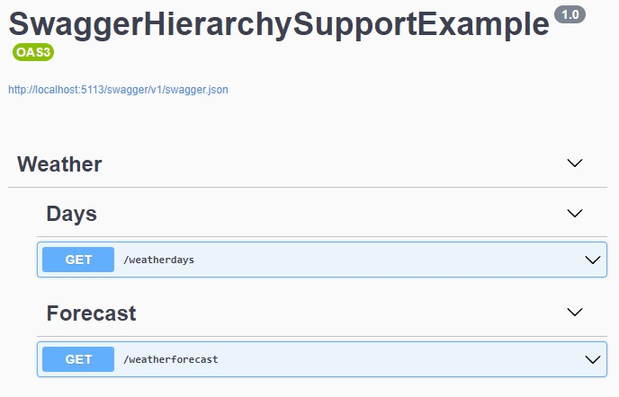

# SwaggerHierarchySupport

This is a small Nuget package that can be used to add support for hierarchical tags in 
SwaggerUI. It uses a plugin for SwaggerUI that is located at:



> [Hierarchical Tags](https://github.com/kael-shipman/swagger-ui-plugins/tree/hierarchical-tags/packages/hierarchical-tags)

To use the plugin, you need to install the Nuget Package:

```
> > dotnet add package WilderMinds.SwaggerUIHierarchySupport
```

Once you've installed the package, you just need to add the support like this:

```csharp
  app.UseSwaggerUI(opt =>
  {
    opt.AddHierarchySupport();
  });
```

To create the hierarchy, you'll want to use Tags with a colon (:) or pipe (|) as delimiters as seen here:

```csharp
app.MapGet("/weatherforecast", () =>
{
  var forecast = Enumerable.Range(1, 5).Select(index =>
      new WeatherForecast
      (
          DateOnly.FromDateTime(DateTime.Now.AddDays(index)),
          Random.Shared.Next(-20, 55),
          summaries[Random.Shared.Next(summaries.Length)]
      ))
      .ToArray();
  return forecast;
})
.WithName("GetWeatherForecast")
.WithTags("Weather:Forcast") // Weather is the top level, and the Forcast is the sub-tag
.WithOpenApi();
```